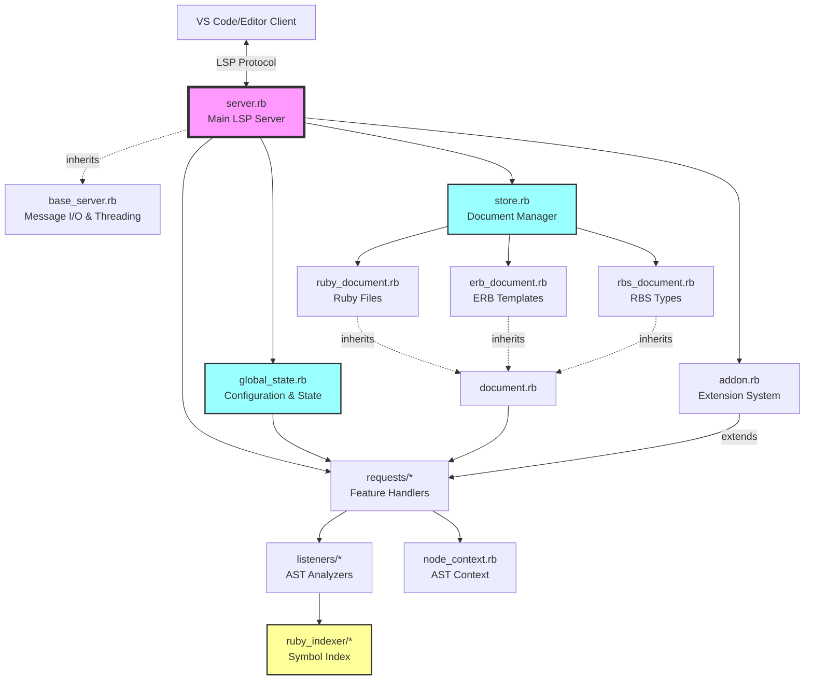

# CLAUDE.md

This file provides guidance to Claude Code (claude.ai/code) when working with code in this repository.

## Project Overview

Ruby LSP is a Language Server Protocol implementation for Ruby, providing IDE features across different editors. The project consists of:

- Core Ruby LSP gem (language server implementation)
- Ruby Indexer (code indexing for navigation)
- VS Code extension (TypeScript frontend)
- Documentation site (Jekyll-based)

## Development Commands

### Ruby LSP Core

```bash
# Run all tests
bundle exec rake

# Run specific test file
bin/test test/requests/completion_test.rb

# Run tests matching a pattern
bin/test test/requests/completion_test.rb test_name_pattern

# Type check with Sorbet
bundle exec srb tc

# Lint with RuboCop
bin/rubocop

# Auto-fix RuboCop violations
bin/rubocop -a
```

### VS Code Extension

```bash
cd vscode
yarn install       # Install dependencies
yarn run lint      # Lint TypeScript code
yarn run test      # Run extension tests
```

### Executables

- `exe/ruby-lsp` - Main language server executable
- `exe/ruby-lsp-check` - Validation tool
- `exe/ruby-lsp-launcher` - Experimental launcher

## Architecture

### Server Structure

The server (`lib/ruby_lsp/server.rb`) processes LSP messages and delegates to:

- **Requests** (`lib/ruby_lsp/requests/`) - Handle specific LSP features
- **Listeners** (`lib/ruby_lsp/listeners/`) - Analyze Ruby code for the specific feature
- **Response Builders** (`lib/ruby_lsp/response_builders/`) - Construct LSP responses

### Key Components

- **Document Store** (`lib/ruby_lsp/document.rb`) - Manages open documents and parsed ASTs
- **Ruby Indexer** (`lib/ruby_indexer/`) - Indexes Ruby code for navigation features
- **Addon System** (`lib/ruby_lsp/addon.rb`) - Extensibility framework for third-party addons

### Design Patterns

- **Visitor Pattern**: AST traversal using Prism parser visitors
- **Request/Response**: Each LSP feature implemented as a request class
- **Type Safety**: Sorbet signatures throughout (strict for lib/, test for tests)

### Important Top-Level Files

#### Core Server Components

- **`lib/ruby_lsp/server.rb`** - Main LSP server handling all client requests and message routing
- **`lib/ruby_lsp/base_server.rb`** - Abstract base with core LSP infrastructure (message I/O, worker threads)
- **`lib/ruby_lsp/global_state.rb`** - Central configuration and state management (formatters, linters, client capabilities)
- **`lib/ruby_lsp/store.rb`** - Document storage and lifecycle management

#### Document Handling

- **`lib/ruby_lsp/document.rb`** - Abstract base for all document types (versioning, edits, encoding)
- **`lib/ruby_lsp/ruby_document.rb`** - Ruby source file handling with Prism parsing
- **`lib/ruby_lsp/erb_document.rb`** - ERB template file handling
- **`lib/ruby_lsp/rbs_document.rb`** - RBS type definition file handling

#### Supporting Infrastructure

- **`lib/ruby_lsp/addon.rb`** - Extension framework for third-party add-ons
- **`lib/ruby_lsp/node_context.rb`** - AST node context information (nesting, scope)
- **`lib/ruby_lsp/type_inferrer.rb`** - Type inference functionality
- **`lib/ruby_lsp/client_capabilities.rb`** - Client feature capability tracking

### Component Interaction Flow



## Testing Approach

Tests use expectation-based patterns:

```ruby
# Tests typically follow this structure:
def test_feature_name
  source = <<~RUBY
    # Ruby code to test
  RUBY

  with_server(source) do |server, _uri|
    # Make LSP request
    # Assert response
  end
end
```

Test fixtures are in `test/fixtures/` and expectations in `test/expectations/`.

## Common Development Tasks

### Adding a New LSP Feature

1. Create request class in `lib/ruby_lsp/requests/`
2. Register in `lib/ruby_lsp/executor.rb`
3. Add tests in `test/requests/`
4. Update VS Code extension if needed

### Working with the Indexer

The Ruby Indexer (`lib/ruby_indexer/`) handles:

- Building symbol tables for classes, modules, methods, and constants
- Resolving constant references and method calls
- Finding definitions across files
- Providing completion candidates for constants and methods
- Dealing with inheritance and ancestor linearization

### Typechecking with Sorbet

Ruby LSP uses Sorbet (typed: strict) with inline RBS annotations for static typechecking.

**Key Guidelines:**

- Use RBS inline annotations (`#:`) exclusively - never use RBI style `sig { }`
- Place type annotations immediately before method definitions or after variable assignments
- Run `bundle exec srb tc` to ensure typechecking passes

**Common RBS Patterns:**

```ruby
# Method signatures (placed above method definition)
#: (String name) -> void
def process(name)
  # ...
end

# Variable annotations (placed after assignment)
@documents = {} #: Hash[URI::Generic, Document]

# Attribute type declarations (placed above attribute)
#: String?
attr_reader :parent_class

# Generic types
#: [T] () { (String) -> T } -> T
def with_cache(&block)
  # ...
end

# Union and nullable types
result = nil #: (String | Symbol)?
```

**Type Syntax Reference:** <https://sorbet.org/docs/rbs-support>
