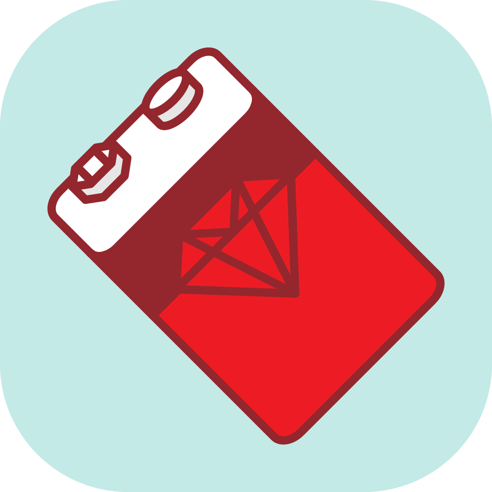

<p align="center">
  
</p>


# Ruby LSP (VS Code extension)

Companion VS Code extension for the [Ruby LSP gem](https://github.com/Shopify/ruby-lsp).

## Usage

Search for `ruby-lsp` in the extensions tab and click install. Please check the configuration section for further
instructions.

### Configuration

The Ruby LSP has all its features enabled by default, but disabling specific features is supported by changing the
following configuration (definition of all available values can be found in the
[package.json](https://github.com/Shopify/vscode-ruby-lsp/blob/main/package.json)).

```jsonc
"rubyLsp.enabledFeatures": {
  "documentHighlights": true,
  "documentSymbols": true,
  "foldingRanges": true,
  "selectionRanges": true,
  "semanticHighlighting": true,
  "formatting": true,
  "diagnostics": true,
  "codeActions": true
}
```

To boot the server properly, the Ruby version manager must be configured, which defaults to using shadowenv.
Check the [package.json](https://github.com/Shopify/vscode-ruby-lsp/blob/main/package.json) for currently supported
managers.

The Ruby LSP uses the Ruby version manager to reactivate the required Ruby version and to select the correct gem and
Bundler paths, which is necessary when switching between projects using different Ruby versions. Use the extension's
`rubyLsp.rubyVersionManager` setting to control which version manager is used.

```jsonc
"rubyLsp.rubyVersionManager": "chruby" // The handle for the version manager (e.g.: chruby, shadowenv)
```

To make sure that the Ruby LSP can find the version manager scripts, make sure that they are loaded in the shell's
configuration script (e.g.: ~/.bashrc, ~/.zshrc) and that the SHELL environment variable is set and pointing to the
default shell.

### Commands

Available commands are listed below and can always be found in the `Ruby LSP` prefix.

| Command           | Description                 |
| ----------------- | --------------------------- |
| Ruby LSP: Start   | Start the Ruby LSP server   |
| Ruby LSP: Restart | Restart the Ruby LSP server |
| Ruby LSP: Stop    | Stop the Ruby LSP server    |

### Snippets

This extension provides convenience snippets for Ruby. Find the full list
[here](https://github.com/Shopify/vscode-ruby-lsp/blob/main/snippets.json).

### Telemetry

On its own, the Ruby LSP does not collect any telemetry by default, but it does support hooking up to a private metrics
service if desired.

In order to receive metrics requests, a private plugin must export the `ruby-lsp.getPrivateTelemetryApi` command, which should
return an object that implements the `TelemetryApi` interface defined [here](https://github.com/Shopify/vscode-ruby-lsp/blob/main/src/telemetry.ts).

Fields included by default are defined in `TelemetryEvent` [here](https://github.com/Shopify/vscode-ruby-lsp/blob/main/src/telemetry.ts).
The exported API object can add any other data of interest and publish it to a private service.

For example,

```typescript
// Create the API class in a private plugin
class MyApi implements TemeletryApi {
  sendEvent(event: TelemetryEvent): Promise<void> {
    // Add timestamp to collected metrics
    const payload = {
      timestamp: Date.now(),
      ...event,
    };

    // Send metrics to a private service
    myFavouriteHttpClient.post("private-metrics-url", payload);
  }
}

// Register the command to return an object of the API
vscode.commands.registerCommand(
  "ruby-lsp.getPrivateTelemetryApi",
  () => new MyApi()
);
```

## Contributing

Bug reports and pull requests are welcome on GitHub at https://github.com/Shopify/vscode-ruby-lsp.
This project is intended to be a safe, welcoming space for collaboration, and contributors
are expected to adhere to the
[Contributor Covenant](https://github.com/Shopify/vscode-ruby-lsp/blob/main/CODE_OF_CONDUCT.md)
code of conduct.

### Debugging

Interactive debugging works for both running the extension or tests. In the debug panel, select whether to run the extension in development mode or run tests, set up some breakpoints and start with F5.

### Tracing LSP requests and responses

LSP server tracing can be controlled through the `ruby lsp.trace.server` config key in the `.vscode/settings.json` config file.

Possible values are:

- `off`: no tracing
- `messages`: display requests and responses notifications
- `verbose`: display each request and response as JSON

### Debugging using VS Code

The `launch.json` contains a 'Minitest - current file' configuration for the debugger.

1. Add a breakpoint using the VS Code UI.
1. Open the relevant test file.
1. Open the **Run and Debug** panel on the sidebar.
1. Ensure `Minitest - current file` is selected in the top dropdown.
1. Press `F5` OR click the green triangle next to the top dropdown. VS Code will then run the test file with debugger activated.
1. When the breakpoint is triggered, the process will pause and VS Code will connect to the debugger and activate the debugger UI.
1. Open the Debug Console view to use the debugger's REPL.

## License

This extension is available as open source under the terms of the
[MIT License](https://github.com/Shopify/vscode-ruby-lsp/blob/main/LICENSE.txt).
