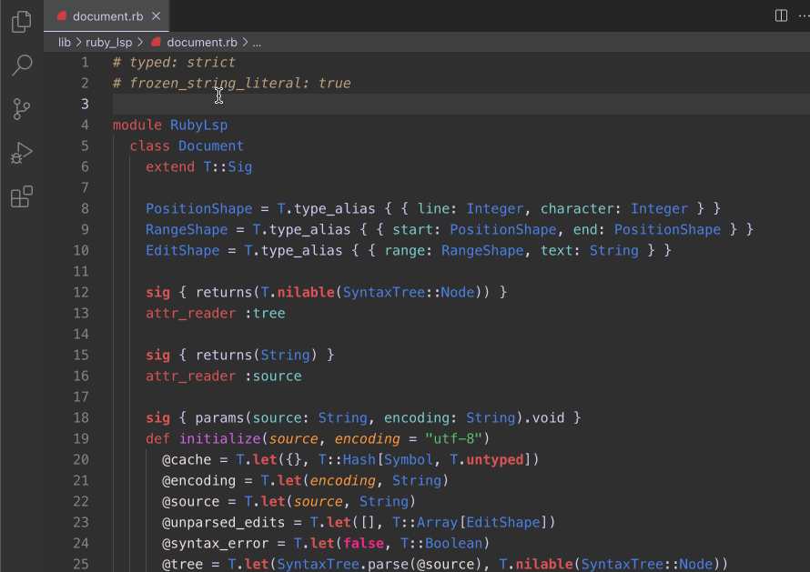

<p align="center">
  
</p>

[](https://github.com/Shopify/ruby-lsp/actions/workflows/ci.yml)
[](https://marketplace.visualstudio.com/items?itemName=Shopify.ruby-lsp)
[](https://join.slack.com/t/ruby-dx/shared_invite/zt-2c8zjlir6-uUDJl8oIwcen_FS_aA~b6Q)

# Ruby LSP

The Ruby LSP is an implementation of the [language server protocol](https://microsoft.github.io/language-server-protocol/)
for Ruby, used to improve rich features in editors. It is a part of a wider goal to provide a state-of-the-art
experience to Ruby developers using modern standards for cross-editor features, documentation and debugging.

Want to discuss Ruby developer experience? Consider joining the public
[Ruby DX Slack workspace](https://join.slack.com/t/ruby-dx/shared_invite/zt-2c8zjlir6-uUDJl8oIwcen_FS_aA~b6Q).

## Features



The Ruby LSP features include

- Semantic highlighting
- Symbol search and code outline
- RuboCop errors and warnings (diagnostics)
- Format on save (with RuboCop or Syntax Tree)
- Format on type
- Debugging support
- Running and debugging tests through VS Code's UI
- Go to definition for classes, modules, constants and required files
- Showing documentation on hover for classes, modules and constants
- Completion for classes, modules, constants and require paths
- Fuzzy search classes, modules and constants anywhere in the project and its dependencies (workspace symbol)

As of July 2024, Ruby LSP has received significant enhancements to its code navigation features. For an in-depth look at these improvements, including video demonstrations, check out this [article](https://railsatscale.com/2024-07-18-mastering-ruby-code-navigation-major-enhancements-in-ruby-lsp-2024/). Despite these advancements, we plan to continue enhancing its code navigation support even further. You can follow our progress on this [GitHub issue](https://github.com/Shopify/ruby-lsp/issues/899).

See complete information about features [here](https://shopify.github.io/ruby-lsp/RubyLsp/Requests.html).

If you experience issues, please see the [troubleshooting
guide](https://github.com/Shopify/ruby-lsp/blob/main/TROUBLESHOOTING.md).

## Usage

### With VS Code

If using VS Code, all you have to do is install the [Ruby LSP
extension](https://marketplace.visualstudio.com/items?itemName=Shopify.ruby-lsp) to get the extra features in the
editor. Do not install the `ruby-lsp` gem manually.

For more information on using and configuring the extension, see [vscode/README.md](vscode/README.md).

### With other editors

See [editors](EDITORS.md) for community instructions on setting up the Ruby LSP, which current includes Emacs, Neovim, Sublime Text, and Zed.

The gem can be installed by doing
```shell
gem install ruby-lsp
```

and the language server can be launched running `ruby-lsp` (without bundle exec in order to properly hook into your
project's dependencies).

### Documentation

See the [documentation](https://shopify.github.io/ruby-lsp) for more in-depth details about the
[supported features](https://shopify.github.io/ruby-lsp/RubyLsp/Requests.html).

For creating rich themes for Ruby using the semantic highlighting information, see the [semantic highlighting
documentation](SEMANTIC_HIGHLIGHTING.md).

### Configuring code indexing

By default, the Ruby LSP indexes all Ruby files defined in the current project and all of its dependencies, including
default gems, except for

- Gems that only appear under the `:development` group
- All Ruby files under `test/**/*.rb`

This behaviour can be overridden and tuned. Learn how to configure it [for VS Code](vscode/README.md#Indexing-Configuration) or [for other editors](EDITORS.md#Indexing-Configuration).

Note that indexing-dependent behavior, such as definition, hover, completion or workspace symbol will be impacted by
the configuration changes.

The older approach of using a `.index.yml` file has been deprecated and will be removed in a future release.

```yaml
# Exclude files based on a given pattern. Often used to exclude test files or fixtures
excluded_patterns:
  - "**/spec/**/*.rb"

# Include files based on a given pattern. Can be used to index Ruby files that use different extensions
included_patterns:
  - "**/bin/*"

# Exclude gems by name. If a gem is never referenced in the project's code and is only used as a tool, excluding it will
# speed up indexing and reduce the amount of results in features like definition or completion
excluded_gems:
  - rubocop
  - pathname

# Include gems by name. Normally used to include development gems that are excluded by default
included_gems:
  - prism
```

### Addons

The Ruby LSP provides an addon system that allows other gems to enhance the base functionality with more editor
features. This is the mechanism that powers addons like

- [Ruby LSP Rails](https://github.com/Shopify/ruby-lsp-rails)
- [Ruby LSP RSpec](https://github.com/st0012/ruby-lsp-rspec)
- [Ruby LSP rubyfmt](https://github.com/jscharf/ruby-lsp-rubyfmt)

Additionally, some tools may include a Ruby LSP addon directly, like

- [Standard Ruby (from v1.39.1)](https://github.com/standardrb/standard/wiki/IDE:-vscode#using-ruby-lsp)

Other community driven addons can be found in [rubygems](https://rubygems.org/search?query=name%3A+ruby-lsp) by
searching for the `ruby-lsp` prefix.

For instructions on how to create addons, see the [addons documentation](ADDONS.md).

## Learn More

* [RubyConf 2022: Improving the development experience with language servers](https://www.youtube.com/watch?v=kEfXPTm1aCI) ([Vinicius Stock](https://github.com/vinistock))
* [Remote Ruby: Ruby Language Server with Vinicius Stock](https://remoteruby.com/221)
* [RubyKaigi 2023: Code indexing - How language servers understand our code](https://www.youtube.com/watch?v=ks3tQojSJLU) ([Vinicius Stock](https://github.com/vinistock))

## Contributing

Bug reports and pull requests are welcome on GitHub at https://github.com/Shopify/ruby-lsp.  This project is intended to
be a safe, welcoming space for collaboration, and contributors are expected to adhere to the [Contributor
Covenant](CODE_OF_CONDUCT.md) code of conduct.

If you wish to contribute, see [CONTRIBUTING](CONTRIBUTING.md) for development instructions and check out our pinned
[roadmap issue](https://github.com/Shopify/ruby-lsp/issues) for a list of tasks to get started.

## License

The gem is available as open source under the terms of the [MIT License](LICENSE.txt).
