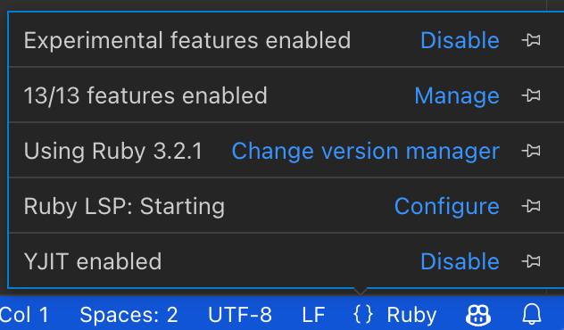

# Ruby LSP

The Ruby LSP is an implementation of the [language server protocol](https://microsoft.github.io/language-server-protocol/)
for Ruby, used to improve rich features in editors.

## Features


The Ruby LSP features include

- Semantic highlighting
- Symbol search and code outline
- RuboCop errors and warnings (diagnostics)
- Format on save (with RuboCop or Syntax Tree)
- Format on type
- Debugging support
- Running and debugging tests through VS Code's UI
- Go to definition for classes, modules, constants and required files
- Showing documentaton on hover for classes, modules and constants
- Completion for classes, modules, constants and require paths
- Fuzzy search classes, modules and constants anywhere in the project and its dependencies (workspace symbol)
- Running Rails generators from the UI

Adding method support for definition, completion, hover and workspace symbol is planned, but not yet completed.

See complete information about features [here](https://shopify.github.io/ruby-lsp/RubyLsp/Requests.html).

If you experience issues, please see the [troubleshooting
guide](https://github.com/Shopify/ruby-lsp/blob/main/TROUBLESHOOTING.md).

### Copilot chat agent

For users of Copilot, the Ruby LSP contributes a Ruby agent for AI assisted development of Ruby applications. Below you
can find the documentation of each command for the Ruby agent. For information about how to interact with Copilot Chat,
check [VS Code's official documentation](https://code.visualstudio.com/docs/copilot/copilot-chat).

#### Design command

The `@ruby /design` command is intended to be a domain driven design expert to help users model concepts for their
applications. Users should describe what type of application they are building and which concept they are trying to
model. The command will read their Rails application's schema and use their prompt, previous interactions and the schema
information to provide suggestions of how to design the application. For example,

```
@ruby /design I'm working on a web application for schools. How do I model courses? And how do they relate to students?
```

The output is a suggested schema for courses including relationships with users. In the chat window, two buttons will appear: `Generate with Rails`, which invokes the Rails generators to create the models suggested, and `Revert previous generation`, which will delete files generated by a previous click in the generate button.

As with most LLM chat functionality, suggestions may not be fully accurate, especially in the first iteration. Users can
continue chatting with the `@ruby` agent to fine tune the suggestions given, before deciding to move forward with
generation.

## Usage

Search for `Shopify.ruby-lsp` in the extensions tab and click install.

By default, the Ruby LSP will generate a `.ruby-lsp` directory with a custom bundle that includes the server gem.
Additionally, it will attempt to use available version managers to select the correct Ruby version for any given
project. Refer to configuration for more options.

### Commands

Available commands are listed below and can always be found by searching for the `Ruby LSP` prefix in the command
palette (Default hotkey: CMD + SHIFT + P).

| Command                              | Description                                             |
| ------------------------------------ | ------------------------------------------------------- |
| Ruby LSP: Start                      | Start the Ruby LSP server                               |
| Ruby LSP: Restart                    | Restart the Ruby LSP server                             |
| Ruby LSP: Stop                       | Stop the Ruby LSP server                                |
| Ruby LSP: Update language server gem | Updates the `ruby-lsp` server gem to the latest version |

### Snippets

This extension provides convenience snippets for common Ruby constructs, such as blocks, classes, methods or even unit
test boilerplates. Find the full list [here](https://github.com/Shopify/ruby-lsp/blob/main/vscode/snippets.json).

### Configuration

#### Enable or disable features

The Ruby LSP allows disabling specific features. To do so, open the
language status center right next to the language mode Ruby and select `Manage` right next to enabled features.



It's also possible to configure with more granularity code lens and inlay hint features, see the [features
documentation](https://shopify.github.io/ruby-lsp/RubyLsp/Requests.html).

#### Ruby version managers

To boot the server properly, the Ruby LSP uses a version manager to activate the right environment variables that point
Bundler to the Ruby and gem paths. This is especially necessary when switching between projects that use different Ruby
versions - since those paths change and need to be reactivated.

By default, the Ruby LSP will attempt to automatically determine which version manager it should use, checking which
ones are available (`auto` option). If that fails, then the version manager must be manually configured. You can do so
by clicking `Change version manager` in the language status center or by changing your VS Code user settings.

```jsonc
// Available options are
// "auto" (select version manager automatically)
// "none" (do not use a version manager)
// "custom" (use rubyLsp.customRubyCommand for finding/activating Ruby)
// "asdf"
// "chruby"
// "rbenv"
// "rvm"
// "shadowenv"
// "mise"
{
  "rubyLsp.rubyVersionManager": {
    "identifier": "chruby",
  },
}
```

To make sure that the Ruby LSP can find the version manager scripts, make sure that they are loaded in the shell's
configuration script (e.g.: ~/.bashrc, ~/.zshrc) and that the SHELL environment variable is set and pointing to the
default shell.

> [!NOTE]
>
> For manager-specific notes, setting up custom activation for managers not listed above and community-contributed
> examples, please see [version managers](https://github.com/Shopify/ruby-lsp/blob/main/VERSION_MANAGERS.md).

#### Configuring a formatter

The tool to be used for formatting files can be configured with the following setting.

```jsonc
// Available options
//    auto: automatically detect the formatter based on the app's bundle (default)
//    none: do not use a formatter (disables format on save and related diagnostics)
//    all other options are the name of the formatter (e.g.: rubocop or syntax_tree)
"rubyLsp.formatter": "auto"
```

#### Ruby version requirement

By default, the Ruby LSP uses the current project's Ruby version and bundle. This allows the LSP to index the correct
gem versions, and to ensure formatting behavior is consistent with CI.

The Ruby LSP and its main dependency [Prism](https://github.com/ruby/prism) (the new Ruby parser) both follow the same
policy, which is to support only Ruby versions that are not beyond their end-of-life.

If you're working on a project with an older Ruby version, it might be possible to install older versions of the server
gem to get support for older rubies, but that might also involve using older versions of the VS Code extension - since
some functionality requires implementations in both client and server.

The other alternative is to use a custom Gemfile separate from the project with a different Ruby version. Notice that
certain functionality may be degraded or require manual configuration, since the Ruby LSP will not be able to inspect
the project's real bundle to discover dependencies. Please see the instructions below.

#### Using a custom Gemfile

If you are working on a project using an older version of Ruby not supported by Ruby LSP, then you may specify a
separate `Gemfile` for development tools.

**Note**: when using this, gems will not be installed automatically and neither will `ruby-lsp` upgrades.

Create a directory to store the custom bundle outside of the project that uses the old Ruby version. Inside that
directory, add your preferred version manager configuration to select a supported Ruby version. For example, if using
`chruby`, it would look like this:

```shell
# the/directory/.ruby-version

3.2.2
```

Create a `Gemfile` for development tools inside that directory.

```ruby
# the/directory/Gemfile

source "https://rubygems.org"

gem "ruby-lsp"
gem "rubocop"
```

> [!NOTE]
>
> Take in mind that formatters, linters and their extensions should be included in the custom gemfile; you might need to add more gems than the ones shown above.
> e.g: If you are using rubocop, you would also need to add them:

```ruby
gem "rubocop-packaging"
gem "rubocop-performance"
gem "rubocop-rspec"
gem "rubocop-shopify"
gem "rubocop-thread_safety"
```

Run `bundle install` inside that directory to generate a lockfile. After the directory contains the custom `Gemfile` and
the version manager configuration, use the following configuration in VS Code to point the Ruby LSP to that `Gemfile`.

```jsonc
{
  "rubyLsp.bundleGemfile": "../../path/to/the/directory/Gemfile",
}
```

> [!NOTE]
>
> `rubyLsp.bundleGemfile` can be a relative or absolute path.

#### Configuring VS Code debugger

To configure the VS Code debugger, you can use the "Debug: Add configuration..." command to create a `launch.json` file
in the `.vscode` directory of your project.

This command would generate the following configuration:

```jsonc
{
  "version": "0.2.0",
  "configurations": [
    {
      "type": "ruby_lsp",
      "name": "Debug",
      "request": "launch",
      "program": "ruby ${file}",
    },
    {
      "type": "ruby_lsp",
      "request": "launch",
      "name": "Debug test file",
      "program": "ruby -Itest ${relativeFile}",
    },
    {
      "type": "ruby_lsp",
      "request": "attach",
      "name": "Attach to existing server",
    },
  ],
}
```

### Debugging live processes

Instead of launching a process to debug every time, you may want to attach the VS Code debugger to an existing process, such as a Rails server. Follow these instructions to do so.

Install `debug` gem. Verify by running `bundle exec rdbg -v`

Run your application with the debugger attached, so that the extension can connect to it.

```shell
bundle exec rdbg -O -n -c -- bin/rails server -p 3000
```

For better integrated rails tests support also install `ruby-lsp-rails` gem.

#### VS Code configurations

In addition to the Ruby LSP's own configuration, there are some VS Code settings that may need to be changed to get the
most of the Ruby LSP. These settings are not specific to the Ruby LSP, but they impact all language servers and take
precedence over any other configurations.

These are the settings that may impact the Ruby LSP's behavior and their explanations.

```jsonc
{
  // All of these settings are scoped only to the Ruby language
  "[ruby]": {
    "editor.defaultFormatter": "Shopify.ruby-lsp", // Use the Ruby LSP as the default formatter
    "editor.formatOnSave": true, // Format files automatically when saving
    "editor.tabSize": 2, // Use 2 spaces for indentation
    "editor.insertSpaces": true, // Use spaces and not tabs for indentation
    "editor.semanticHighlighting.enabled": true, // Enable semantic highlighting
    "editor.formatOnType": true, // Enable formatting while typing
  },
}
```

### Multi-root workspaces

Multi-root workspaces are VS Code's way to allow users to organize a single repository into multiple distinct concerns.
Notice that this does not necessarily match the concept of a project. For example, a web application with separate
directories for its frontend and backend may be conceptually considered as a single project, but you can still configure
the frontend and backend directories to be different workspaces.

The advantage of adopting this configuration is that VS Code and all extensions are informed about which directories
should be considered as possible workspace roots. Instead of having to configure each extension or tool individually so
they are aware of your project structure, you only have to do that once for the entire repository.

Some examples of functionality that benefits from multi-root workspaces:

- Extensions that have to integrate with project dependencies (Gemfile, package.json), such as debuggers, language
  servers, formatters and other tools, are informed about where to search for these files (allowing for automatic
  detection)
- If `launch.json` configurations are placed inside a workspace, VS Code will know to launch them from the appropriate
  directory ([Ruby LSP example](https://github.com/Shopify/ruby-lsp/blob/main/vscode/.vscode/launch.json)), without
  requiring you to specify the `cwd`
- When opening a terminal, VS Code will offer to open the terminal on all configured workspaces

The Ruby LSP supports multi-root workspaces by spawning a separate language server for each one of them. This strategy
is preferred over a single language server that supports multiple workspaces because each workspace could be using a
different Ruby version and completely different gems - which would be impossible to support in a single Ruby process.

What matters to properly spawn the Ruby LSP is knowing where the main Gemfile of each workspace inside of the same
repository is.

#### Example configurations

> [!NOTE]
> To make sure Ruby LSP works well with your multi-root workspace project, please
> read through the instructions below and configure it following the examples.
> After configuring, do not forget to tell VS Code to open the workspace from the
> code-workspace file

Consider a project where the top level of the repository is a Rails application and a sub-directory called `frontend`
contains a React application that implements the frontend layer.

```
my_project/
  frontend/
  Gemfile
  Gemfile.lock
  config.ru
  super_awesome_project.code-workspace
```

A possible configuration for the `super_awesome_project` would be this:

```jsonc
{
  "folders": [
    // At the top level of the repository, we have the Rails application
    {
      "name": "rails",
      "path": ".",
    },
    // Inside the frontend directory, we have the React frontend
    {
      "name": "react",
      "path": "frontend",
    },
  ],
  "settings": {
    // To avoid having VS Code display the same files twice, we can simply exclude the frontend sub-directory. This
    // means it will only show up as a separate workspace
    "files.exclude": {
      "frontend": true,
    },
  },
}
```

Now consider a monorepo where both the client and the server are under sub-directories.

```
my_project/
  client/
  server/
    Gemfile
    Gemfile.lock
  super_awesome_project.code-workspace
```

In this case, we can configure the workspaces as:

```jsonc
{
  "folders": [
    // Both parts of the project (client and server) are inside sub-directories. But since the top level might contain
    // some documentation or build files, we still want it to show up
    {
      "name": "awesome_project",
      "path": ".",
    },
    // Inside the client directory, we have the client part of the project
    {
      "name": "client",
      "path": "client",
    },
    // Inside the server directory, we have the server part of the project
    {
      "name": "server",
      "path": "server",
    },
  ],
  "settings": {
    // We don't want to show duplicates, so we hide the directories that are already showing up as workspaces
    "files.exclude": {
      "server": true,
      "client": true,
    },
  },
}
```

For more information, read VS Code's [workspace documentation](https://code.visualstudio.com/docs/editor/workspaces) and
[multi-root workspace documentation](https://code.visualstudio.com/docs/editor/workspaces#_multiroot-workspaces).

### Developing on containers

The Ruby LSP is a detached language server, which means it's a background process that runs separately from the VS Code
instance. To provide its functionality, the Ruby LSP must be running in the same place where your project files exist
and dependencies are installed.

VS Code supports connecting to containers out of the box, which makes all editor features work seamlessly. That includes
language servers, the integrated terminal, etc. The VS Code documentation has instructions on how to develop on
containers locally or remotely. Please check the following resources before opening an issue:

- [Developing inside a Container](https://code.visualstudio.com/docs/devcontainers/containers)
- [Advanced container configuration](https://code.visualstudio.com/remote/advancedcontainers/overview)

Please note that only Docker is officially supported as a backend by the Dev Container extension. <sup>[1](https://code.visualstudio.com/remote/advancedcontainers/docker-options)</sup>

## Telemetry

The Ruby LSP does not collect any telemetry by default, but it supports hooking up to a private metrics service if
desired. This can be useful if you'd like to understand adoption, performance or catch errors of the Ruby LSP within
your team or company.

To collect metrics, another VS Code extension (typically a private one) should define the command
`getTelemetrySenderObject`. This command should return an object that implements the
[vscode.TelemetrySender](https://code.visualstudio.com/api/references/vscode-api#TelemetrySender) interface, thus
defining where data and error reports should be sent to. For example:

```typescript
// Your private VS Code extension

class Telemetry implements vscode.TelemetrySender {
  constructor() {
    // Initialize some API service or whatever is needed to collect metrics
  }

  sendEventData(eventName: string, data: EventData): void {
    // Send events to some API or accumulate them to be sent in batch when `flush` is invoked by VS Code
  }

  sendErrorData(error: Error, data?: Record<string, any> | undefined): void {
    // Send errors to some API or accumulate them to be sent in batch when `flush` is invoked by VS Code
  }

  async flush() {
    // Optional function to flush accumulated events and errors
  }
}

export async function activate(context: vscode.ExtensionContext) {
  const telemetry = new Telemetry();
  await telemetry.activate();

  // Register the command that the Ruby LSP will search for to hook into
  context.subscriptions.push(
    vscode.commands.registerCommand("getTelemetrySenderObject", () => {
      return telemetry;
    }),
  );
}
```

## Formatting

When `rubyLsp.formatter` is set to `auto`, Ruby LSP tries to determine which formatter to use.

If the bundle has a **direct** dependency on a supported formatter, such as `rubocop` or `syntax_tree`, that will be used.
Otherwise, formatting will be disabled and you will need add one to the bundle. Using globally installed formatters or
linters is not supported, they must in your Gemfile or gemspec.

## Indexing Configuration

To configure indexing, pass a JSON hash as part of the Ruby LSP configuration, for example:

```jsonc
// PROJECT/.vscode/settings.json
{
  "rubyLsp.indexing": {
    "excludedPatterns": ["**/test/**.rb"],
    "includedPatterns": ["**/bin/**"],
    "excludedGems": ["rubocop", "rubocop-performance"],
    "includedPatterns": ["rake"],
    "excludedMagicComments": ["compiled:true"],
  },
}
```
